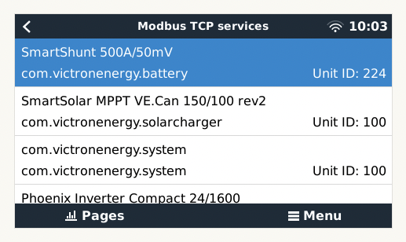
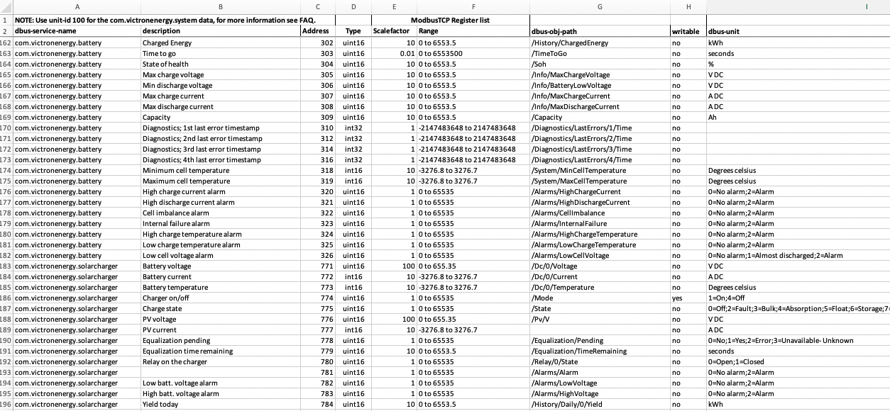
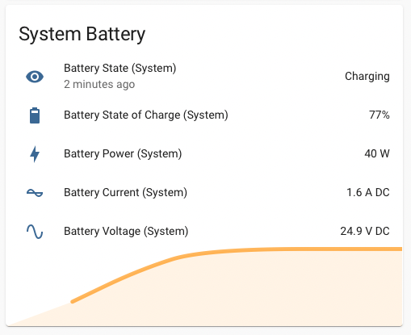

# Victron Energy

This section describes how to add Victron Energy devices into Home Assistant.

## Enable Modbus TCP

Go to the `remote console` for the Cerbo GX device and ensure Modbus is enabled (it's disabled by default).

Settings >> Services >> Modbus TCP >> Select `Enabled`

Next click into the `Available services` section of this menu and you should see a list of entries with familiar looking descriptions to your victron devices such as `SmartShunt` and associated `Unit ID` values (which we will require for identifying them later on).



In my setup I have the following:
**Note: This is likely where your setup will have different values.**

| Name                             | Type         | ID  |
| -------------------------------- | ------------ | --- |
| SmartShunt 500A/50mV             | battery      | 224 |
| SmartSolar MPPT 150/100          | solarcharger | 100 |
| (no entry name)                  | system       | 100 |
| Phoenix Inverter Compact 24/1600 | vebus        | 227 |
| Skylla-i 24/80A (1+1)            | charger      | 100 |

As can be seen from the above there is a generic, unnamed `com.victron.system` type device in the list with a `Unit ID` of `100`. This is the Cerbo GX device. The `IDs` have been stored inside the `secrets.yaml` configuration file as follows:

```yaml
# file: secrets.yaml
# victron `Unit IDs` from Modbus settings
com.victronenergy.system: 100
com.victronenergy.battery: 224
com.victronenergy.vebus: 227
com.victronenergy.solarcharger: 100
```

## Modbus Device Basic Concepts

### Reading Values

This is explained in far more detail elsewhere, including in the [Victron Energy: GC Modbus-TCP Manual](https://www.victronenergy.com/live/ccgx:modbustcp_faq), but in order to effectively utilise modbus devices we need to know both the `Unit ID` of the physical hardware and then the associated `register address` for the sensor/switch that we'd like to read/write. Whilst you can find the `Unit ID` above, the specifics for the `registers` have to be found from the manufacturers specification. In the instance of Victron they publish theirs in an Excel file that you need to download from their website. The version I am using is `CCGX-Modbus-TCP-register-list-2.90` which can be found [here](https://www.victronenergy.com/support-and-downloads/technical-information). It'll contain information similar to the below.



| dbus-service-name        | description                        | Address | Type   | Scalefactor | Range             | dbus-obj-path                | writable | dbus-unit                       |
| ------------------------ | ---------------------------------- | ------- | ------ | ----------- | ----------------- | ---------------------------- | -------- | ------------------------------- |
| com.victronenergy.system | Battery Voltage (System)           | 840     | uint16 | 10          | 0 to 6553.5       | /Dc/Battery/Voltage          | no       | V DC                            |
| com.victronenergy.system | Battery Current (System)           | 841     | int16  | 10          | -3276.8 to 3276.7 | /Dc/Battery/Current          | no       | A DC                            |
| com.victronenergy.system | Battery Power (System)             | 842     | int16  | 1           | -32768 to 32767   | /Dc/Battery/Power            | no       | W                               |
| com.victronenergy.system | Battery State of Charge (System)   | 843     | uint16 | 1           | 0 to 100          | /Dc/Battery/Soc              | no       | %                               |
| com.victronenergy.system | Battery state (System)             | 844     | uint16 | 1           | 0 to 65536        | /Dc/Battery/State            | no       | 0=idle;1=charging;2=discharging |
| com.victronenergy.system | Battery Consumed Amphours (System) | 845     | uint16 | -10         | 0 to -6553.6      | /Dc/Battery/ConsumedAmphours | no       | Ah                              |

As a result, using the above information, if we wanted to read the `Battery state` from the `system` (as opposed to the smart shunt) we would need to construct a sensor inside Home Assistant that targets slave `100` and address `844`. This would provide us with an unsigned integer of 0, 1 or 2 as possible return values indicating the state of the battery (idle, charging, discharging).

We can test this out quickly using raw python.

```zsh
# create a virtual environment
python -m venv env
source env/venv/activate

# install pymodbus
pip install --upgrade pip 'pymodbus[serial]'
```

Inside the python interpreter.

```py
from pymodbus.client import ModbusTcpClient
client = ModbusTcpClient('einstein.local')

response = client.read_holding_registers(844, slave=100)
print(response.registers[0])  # first item in the register

client.close()
```

### Writing Values

In order to control modbus devices we can write to them. As we saw from the above table however all of the services in question had `no` in the `writable` column. We'll instead attempt to toggle the inverter on and off. This was on the `vebus` connection and the service in question we want is the `Switch Position`

| dbus-service-name       | description     | Address | Type   | Scalefactor | Range      | dbus-obj-path | writable | dbus-unit                                 |
| ----------------------- | --------------- | ------- | ------ | ----------- | ---------- | ------------- | -------- | ----------------------------------------- |
| com.victronenergy.vebus | Switch Position | 33      | uint16 | 1           | 0 to 65536 | /Mode         | yes      | 1=Charger Only;2=Inverter Only;3=On;4=Off |

Setting the value to anything between `1` and `4` on the address `33` for slave `227` will therefore modify the state of the inverter accordingly.

We can test this out quickly using raw python inside the same python interpreter from previous read steps.

```py
from pymodbus.client import ModbusTcpClient
client = ModbusTcpClient('einstein.local')

# find current state
response = client.read_holding_registers(33, slave=227)
print(response.registers[0])  # first item in the register

# set new value to 4 (off)
client.write_registers(33, 4, slave=227)

client.close()
```

## Home Assistant

In order to integrate our above ModbusTCP understanding into Home Assistant we need to perform a few steps:

1. Enable the `Modbus` extension - inside the `configuration.yaml`;
2. Provide this extension with a list of available services and how to interpret them - inside the `modbus.yaml`; and
3. Explain how to translate the returned enums into human readable responses - inside the `sensor/modbus_sensor.yaml` file.

### Modbus extension: `configuration.yaml`

Home Assistant comes with an inbuilt extension to support the Modbus protocol. Full documentation can be found [here](https://www.home-assistant.io/integrations/modbus). The extension needs to be enabled within the `configuration.yaml` file however as opposed to being added via the UI.

```yaml title="configuration.yaml"
--8<-- "home-assistant/configuration.yaml:21:24"
```

We're going to follow a separation of concerns and keep our modbus service configuration in a separate file called `modbus.yaml`. Our templates (for displaying enums) will be within a dedicated `sensor/sensor_modbus.yaml` file. The folder structure will therefore look as follows:

```zsh
config
├── configuration.yaml
├── modbus.yaml
├── secrets.yaml
└── sensor
    └── sensor_modbus.yaml
```

### Services: `modbus.yaml`

The `modbus.yaml` file configures the extension with the known endpoints for our Cerbo GX, the connected devices, and their capabilities (published as services). An example is given below, simply add additional entries into the `sensors` section the mapping of yaml to the spreadsheet above should be fairly obvious, with the exception of the `scale` (needs to be `1 / [scalefactor]`) and `precision` (how accurate the value is in decimal places).

```yaml title="modbus.yaml"
--8<-- "home-assistant/modbus.yaml:9:245"
```

### Templates: `sensor/sensor_modbus.yaml`

This has to be done in hideous yaml unfortunately using jinja2 syntax... We use `if` `then` `else` type flows in order to return the correct human readable representation of the enum.

**NB:** Note how we are referencing `battery_state_system` as the root sensor. Home Assistant will automatically escape the human readable "Battery state (System)" description given to it in our `modbus.yaml` file originally.

```yaml title="sensor/sensor_modbus.yaml"
--8<-- "home-assistant/sensor/sensor_modbus.yaml"
```

You should now be able to create a card within Home Assistant that contains the details and history for the system battery.



## Sources

Thanks to the following for resources used in this process of learning:

- [Victron Energy Forums: HA Modbus Integration Tutorial](https://community.victronenergy.com/questions/78971/home-assistant-modbus-integration-tutorial.html)
- [lucode/home-assistant](https://github.com/lucode/home-assistant)
- [Home Assistant: Modbus](https://www.home-assistant.io/integrations/modbus)
- [Victron Energy: GC Modbus-TCP Manual](https://www.victronenergy.com/live/ccgx:modbustcp_faq)
