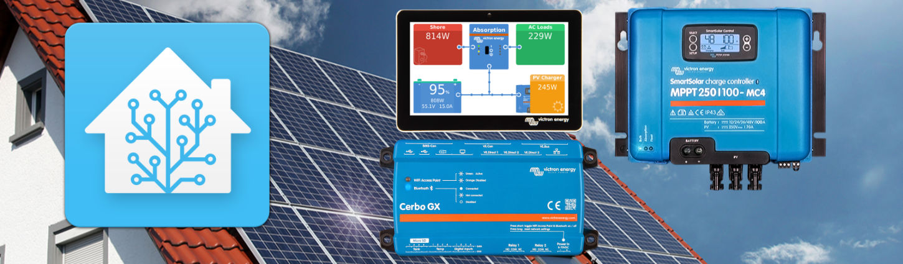

---
hide:
  #   - footer
  - navigation
#   - toc
---

## Background

In 2022 I decided to take my home office / workshop / mancave and move it off-grid.

Armed with a vision, (very) limited skills, and some weekends I set forth to design a system which would allow me to generate my own electricity whilst I worked from home (circa. 3days a week) and become 100% self-sufficient.

I wanted to be able to create, store, and maximise the efficiency electricity within the building. Being a tech and data junkie this meant integrating various systems to provide holistic information and learning new protocols.

This repository is designed to document my approach to setting up a basic Home Assistant installation with a connection to Victron Energy devices (solar mppt charge controller, battery smartshunt, inverter etc.).

Many of the settings will require changing for your local configuration so **please read the documentation** before attempting to blindly run a `docker compose up -d`.

For details on what's included in the documentation and planned in the future refer to the [Roadmap](todo.md).

## How to use this documentation

The documentation is structured into a few sections:

1. [Lessons Learned](lessons-learned.md): let's do this upfront... key things I've learned, mistakes made, and what I'd do differently next time.
2. **Getting Started:** what you're going to need to attempt the same as me
3. **System Overview:** high level design and decisions for the system
4. **Home Assistant:** the brains of the operation
5. **Victron Energy:** setup and integration of Victron solar and energy storage
