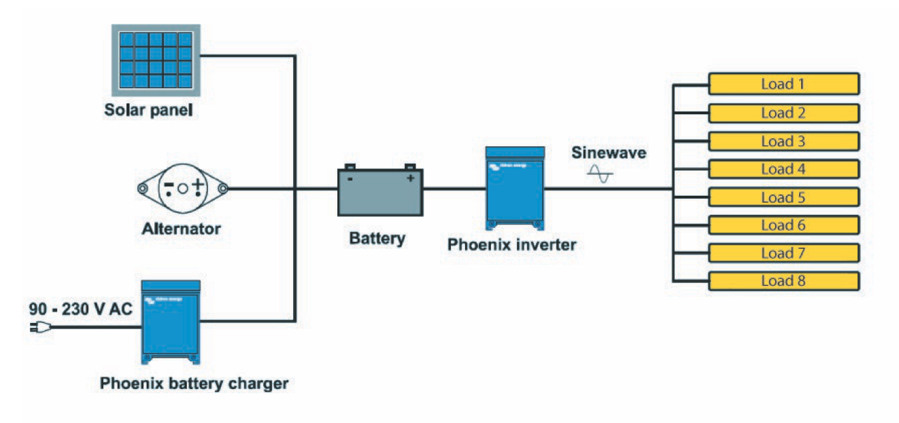
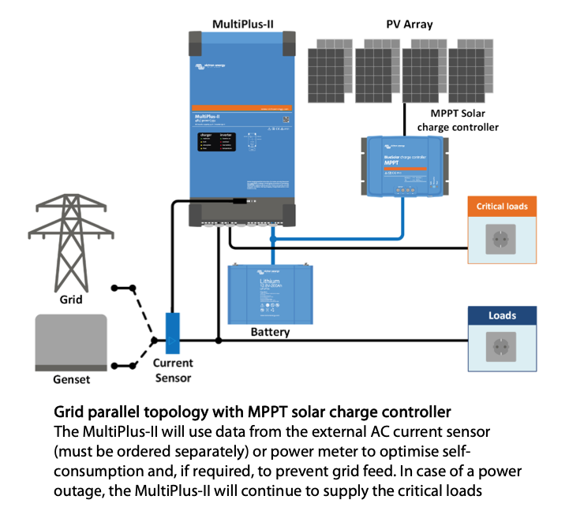
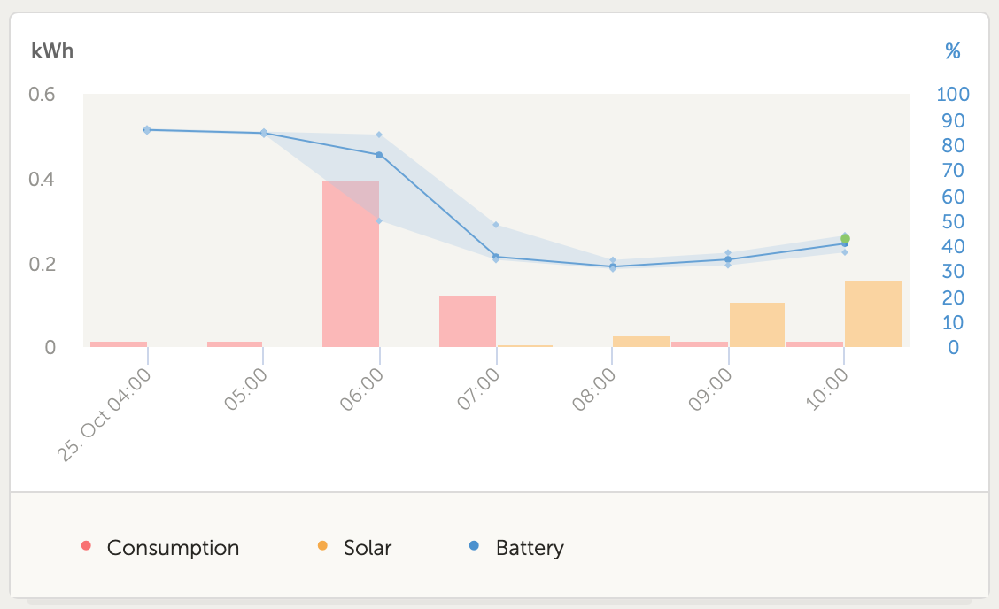
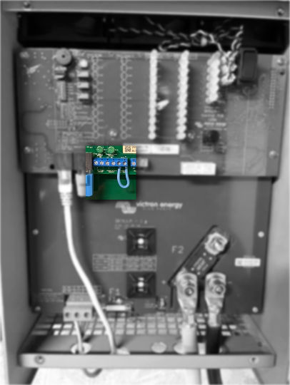

---
hide:
  #   - footer
  - navigation
  #   - toc
---

Some of the things that I've learned along the way that are worth referencing upfront...

## You'll likely need batteries, even if you're not interested in storing long term

Ultimately the loads on the circuit will dictate but I found out the hard way that solar panels + charge controller alone simply couldn't compensate for the spikes for kit such as coffee machines. The pull was too great in too short a period and so the inverter turned off with "low voltage" errors.

Connecting the batteries provided a stable "burst" capacity to fill in the gaps and I no longer had any issues afterwards.

## Grid connecting power requires specialist kit

As detailed in the [system overview](system-overview.md) section I've gone with Victron Energy kit wherever possible and have utilised eBay heavily for second hand components to keep costs down. I therefore ended up with a [Phoenix Inverter](https://www.victronenergy.com/inverters/phoenix-inverter-compact) which is designed for 100% off-grid living and comfortably handles 1,000W of AC output.

What it doesn't do however is handle grid connections. If, for example, I wanted to output power into the house (or augment low power from the PV panels with grid energy) this would be physically impossible. You need to have both AC power sources (grid and inverter) synchronise their waveforms otherwise they fight each other and simply wont work. You'll only be able to power a circuit with a single source, so pick the right one.

??? info "Phoenix Inverter diagram"

    
    <small>source: [Victron Energy: Phoenix Inverter Compact documentation](https://www.victronenergy.com/upload/documents/Datasheet-Phoenix-Inverter-1200VA-5000VA-EN.pdf)</small>

My understanding is that kit such as the [Multiplus II](https://www.victronenergy.com/inverters-chargers/multiplus-ii) range or dedicated micro-inverters **can** handle this.

??? info "Multiplus II diagram"

    
    <small>source: [Victron Energy: Multiplus II documentation](https://www.victronenergy.com/upload/documents/Datasheet-MultiPlus-II-inverter-charger-EN.pdf)</small>

This is fine for my use case - where I'm expecting to create more energy over the 4days a week I'm not in the building than I consume in the 3days I am - but for others you may need to adjust your purchasing (or system design) accordingly.

## Cable sizing is important

This might seem obvious but the thickness of the cables purchased impact two things primarily:

- **Ampacity** (throughput) that can be supported. Think of it like the width of a road / number of lanes. Standard measures are referenced in both cross-sectional area (mm2) and diameter (mm) so ensure you understand the difference whilst the US [AWG (American Wire Guage)](https://en.wikipedia.org/wiki/American_wire_gauge) provides another widely used method. In UK houses we use 2.5mm2 cabling for the mains circuits which are rated to around 20A (hence why most of your breakers in the consumer unit are 16A for safety).
- The **voltage drop** that can be experienced. Think of it like the resistance in the cable and, the longer it is (and the higher the resistance), the more likely it is that you'll lose power between one end of the cable and the other.

There are industry standards for both of the above (and online calculators) so just make sure you check. The larger the cable the better for our use cases though in general.

The voltage drop could catch you out if you're taking low voltage from solar panels (eg. 32V), running the output through long, thing cables into a charge controller (which needs a certain voltage to even turn on), and then intending to charge batteries with a voltage of 24V. Doesn't leave a lot of margin for error.

I sense checked my cable (before cutting any lengths) by temporarily wiring a single panel into the entire drum of PV cable (circa. 50m) and measuring the resulting voltage at the other end of it. Theory being that if it was ok after the full 50m then I didn't need to worry about smaller lengths.

## It's cheaper to heat a person than a space

I have a relatively simple 800W electric radiator which was previously set to keep the building at a set temperature when I was due to be working in it. During the winter it came on at 0600, started heating the office, and quickly reduced my available battery down to ~30% before the solar kicked in and started to recharge it.

Bear this in mind. It's easier to put on another layer, have a blanket etc. than attempt to heat an entire space if you don't need to. I'd rather save the power for something else 9 times out of 10.

 <small>source: Victron Energy VRM portal</small>

## You'll probably want the Cerbo GX on Ethernet

Because when you turn off the inverter or disconnect AC loads for any reason the WiFi Access Point will disappear and you won't be able to connect to turn it back on ...!

## The Skylla-i battery charger needs to be shorted

If you aren't going to use the voltage sensors (like me) because you're going to control the device in another way / use as a direct power supply make sure you pass a small wire between the two terminals in order to short it. Otherwise it'll simply not start - lost a day of my life with this one... read the manual!

???+ info "Skylla-i photo"

    
     <small>Showing required cable for shorting the Skylla-i.</small>
